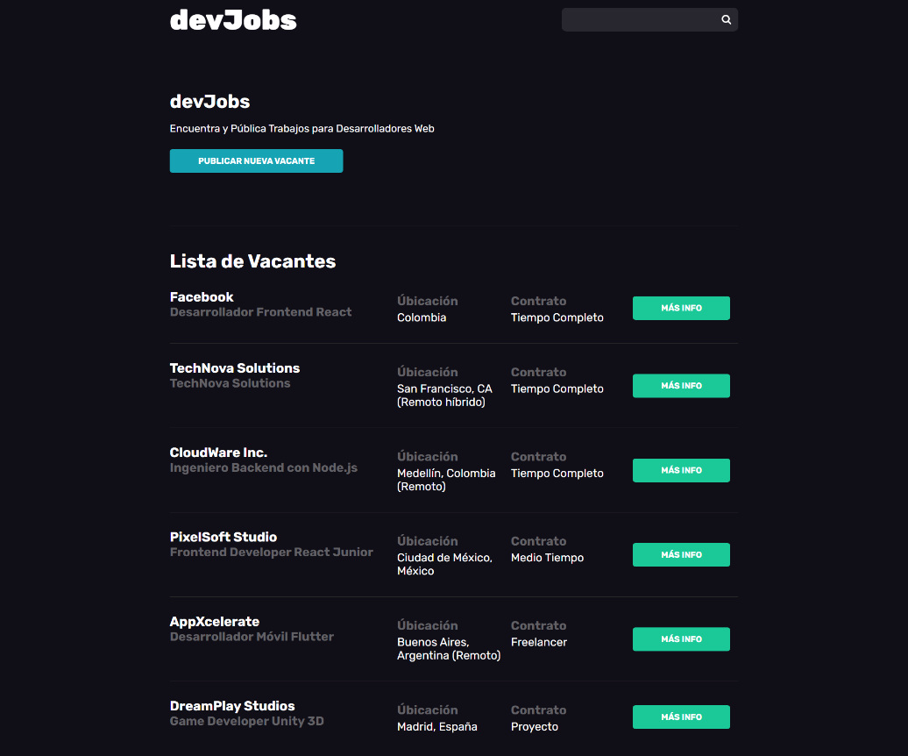

# 💼 DevJobs

La aplicación permite a los usuarios **publicar vacantes de empleo**, visualizar información detallada de cada oferta, y postularse enviando su **CV al reclutador**. También incluye un panel administrativo para gestionar vacantes, candidatos y el perfil del usuario de forma eficiente.  

---

## 📑 Índice

1. [🚀 Tecnologías utilizadas](#-tecnologías-utilizadas)  
2. [⚙️ Funcionalidades principales](#️-funcionalidades-principales)  
3. [🧪 Usuarios de prueba](#-usuarios-de-prueba)  
4. [📦 Instalación local](#-instalación-local)  
5. [🖼️ Capturas de pantalla](#️-capturas-de-pantalla)  
6. [🔌 Endpoints principales](#-endpoints-principales)  
   - [🔐 Autenticación](#-autenticación-auth)  
   - [💼 Vacantes](#-vacantes-vacancies)  
   - [👤 Usuarios](#-usuarios-users)  
   - [🔎 Búsqueda](#-búsqueda-search)  
7. [👤 Autor](#-autor)  

---

## 🚀 Tecnologías utilizadas

- **Node.js** + **Express**
- **MongoDB** + **Mongoose**
- **Handlebars** (motor de plantillas)
- **Passport.js** (autenticación local)
- **Bcrypt** (hash de contraseñas)
- **Multer** (subida de archivos e imágenes)
- **Nodemailer** + **Express-Handlebars** (envío de correos)
- **http-errors** (gestión de errores HTTP)
- **dotenv** (variables de entorno)

---

## ⚙️ Funcionalidades principales

- Registro y autenticación de usuarios (con validaciones y alertas)  
- Creación, edición y eliminación de vacantes  
- Asociación de vacantes a reclutadores (relación User → Vacancy)  
- Subida de imágenes de perfil y CV con validación de formato y tamaño  
- Vista pública de vacantes y detalles individuales  
- Postulación a vacantes con registro de candidatos  
- Panel administrativo con gestión de vacantes y candidatos  
- Recuperación de contraseñas mediante token enviado por correo  
- Buscador de vacantes con índice en MongoDB  
- Middleware de seguridad para rutas protegidas  
- Manejo de errores personalizados con vistas dinámicas  

---

## 🧪 Usuarios de prueba

Puedes iniciar sesión con estos usuarios predefinidos:  

- 📧 **prueba@gmail.com**  
  🔑 **Prueba123**  

- 📧 **prueba1@gmail.com**  
  🔑 **Prueba**  

> *Credenciales solo para fines de prueba*  

---

## 📦 Instalación local

1. Clona el repositorio:

   ```bash
   git clone https://github.com/tu-usuario/devjobs.git
   cd devjobs
Instala dependencias:

2. npm install

3. Crea un archivo .env
   - DB_URI=mongodb://localhost:27017/devjobs
   - SESSION_SECRET=un_secreto_seguro
   - EMAIL_HOST=smtp.tucorreo.com
   - EMAIL_PORT=587
   - EMAIL_USER=correo@tucorreo.com
   - EMAIL_PASS=contraseña

4. Ejecuta los seeders para generar datos de prueba (usuarios, propiedades, categorías, etc.)

5. Inicia el servidor: npm run dev

6. Visita la app en: http://localhost:4000

## 👤 Autor
Desarrollado por Miguel Ortiz.

## 🖼️ Capturas de pantalla


### Página principal


### Detalle de vacante


### Panel de administración


### Perfil de usuario


### Panel de administración


## 🔌 Endpoints de la API – DevJobs

### 🔐 Autenticación (`/auth`)

| Método | Ruta                      | Descripción                                             |
|--------|---------------------------|---------------------------------------------------------|
| GET    | /register                 | Muestra el formulario de registro                      |
| POST   | /register                 | Registra un nuevo usuario                              |
| GET    | /login                    | Muestra el formulario de inicio de sesión              |
| POST   | /login                    | Procesa el inicio de sesión                            |
| GET    | /logout                   | Cierra la sesión del usuario                           |
| GET    | /recover-password         | Muestra formulario para solicitar restablecer password |
| POST   | /recover-password         | Envía email para restablecer contraseña                |
| GET    | /recover-password/:token  | Verifica token de recuperación                         |
| POST   | /recover-password/:token  | Establece la nueva contraseña                          |

---

### 🖥️ Dashboard (`/admin`)

| Método | Ruta            | Descripción                           |
|--------|-----------------|---------------------------------------|
| GET    | /admin          | Vista principal del panel admin       |
| GET    | /candidates/:id | Lista los candidatos de una vacante   |

---

### 🏠 Vacantes (`/vacancies` y `/vacancy`)

| Método | Ruta                 | Descripción                                |
|--------|----------------------|--------------------------------------------|
| GET    | /                    | Muestra todas las vacantes publicadas      |
| GET    | /vacancies/new       | Formulario para crear una nueva vacante    |
| POST   | /vacancies/new       | Agrega nueva vacante a la base de datos    |
| GET    | /vacancy/:url        | Muestra la información pública de vacante  |
| POST   | /vacancy/:url        | Permite a candidatos enviar su CV en PDF   |
| GET    | /vacancy/edit/:url   | Formulario para editar una vacante         |
| POST   | /vacancies/edit/:url | Actualiza información de la vacante        |
| DELETE | /vacancy/delete/:id  | Elimina una vacante existente              |
| POST   | /search              | Buscador de vacantes                       |

---

### 👤 Perfil (`/profile`)

| Método | Ruta      | Descripción                              |
|--------|-----------|------------------------------------------|
| GET    | /profile  | Muestra el perfil del usuario            |
| POST   | /profile  | Actualiza el perfil con imagen de usuario |